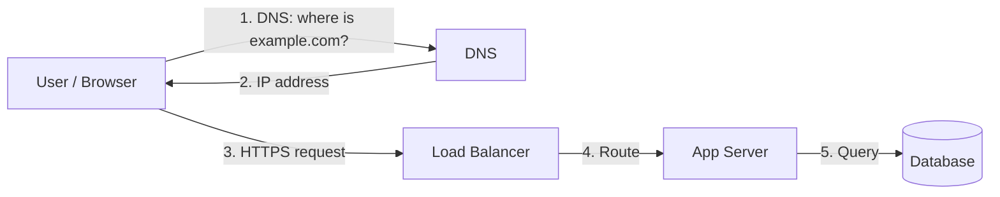

# System Design — Study Log

Chronological notes from the interview-prep program. Phase 1: fundamentals (client-server, load balancers, caching, SQL vs NoSQL, CAP). Later phases: HLD progressions and LLD/OOD.

---

## Phase 1 — Fundamentals

### 1. How the web actually works

Every web app is a conversation: **client** (browser/app) asks, **server** answers.

- **DNS** turns names into IPs. It's the phonebook — cached heavily, slow to change.
- **HTTP(S)** is request/response and stateless: the server remembers nothing between requests unless you store it (sessions, tokens, cookies).
- **Latency** is distance + work. Everything in system design is about shrinking one of those.

### 2. Load balancers

One server dies or gets slow — you need many. A **load balancer** sits in front and spreads requests.

- Algorithms: round-robin, least-connections, IP hash (sticky sessions).
- Health checks: dead servers get pulled out of rotation automatically.
- It's also where TLS termination usually happens.

Rule of thumb: if a box can die, put two of it behind a load balancer.

### 3. Caching

Don't recompute what you already know. Cache at every layer:

| Layer | What lives there | Example |
| ----- | ---------------- | ------- |
| Browser | Static assets | Cache-Control headers |
| CDN | Images, JS, CSS near users | CloudFront, Cloudflare |
| App | Hot DB rows, sessions | Redis, Memcached |
| DB | Query results | Built-in query cache |

Two patterns that cover 90% of interviews:
- **Cache-aside**: app checks cache → miss → read DB → fill cache. Simple, most common.
- **Write-through**: write to cache and DB together. Slower writes, never stale.

And the two hard questions: **eviction** (LRU when full) and **invalidation** (TTL expiry is the honest default — "there are only two hard things in CS: cache invalidation and naming things").

### 4. SQL vs NoSQL

| | SQL (Postgres, MySQL) | NoSQL (Mongo, Dynamo, Cassandra) |
|---|---|---|
| Schema | Fixed, enforced | Flexible |
| Scaling | Vertical first, harder horizontal | Built for horizontal |
| Joins | Yes, powerful | Denormalize instead |
| Best for | Money, orders — correctness matters | Feeds, sessions, huge write volume |

Interview default: start SQL (you know your data), move to NoSQL when a specific scale pain forces it. Never start with "we'll use Cassandra" for a todo app.

### 5. CAP theorem

When the network splits (and it will), you pick two:
- **Consistency**: everyone sees the same data.
- **Availability**: every request gets an answer.
- **Partition tolerance**: keeps working when nodes can't talk — you don't get to opt out of this one in a distributed system.

So the real choice is **CP vs AP**: bank ledger → CP (refuse rather than lie); social feed → AP (show something slightly stale, sync later). Most interview answers: "AP with eventual consistency, except the money part."

---

*Next: Phase 2 — a full HLD walkthrough (TinyURL), then LLD/OOD patterns.*
