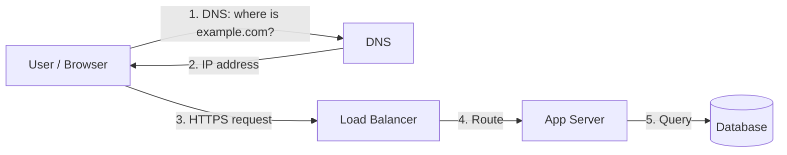
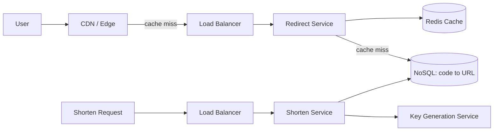

# System Design — Study Log

Chronological notes from the interview-prep program. Phase 1: fundamentals (client-server, load balancers, caching, SQL vs NoSQL, CAP). Later phases: HLD progressions and LLD/OOD.

---

## Phase 1 — Fundamentals

### 1. How the web actually works

Every web app is a conversation: **client** (browser/app) asks, **server** answers.


```mermaid
flowchart LR
    U[User / Browser] -->|1. DNS: where is example.com?| D[DNS]
    D -->|2. IP address| U
    U -->|3. HTTPS request| LB[Load Balancer]
    LB -->|4. Route| S[App Server]
    S -->|5. Query| DB[(Database)]
```

- **DNS** turns names into IPs. It's the phonebook — cached heavily, slow to change.
- **HTTP(S)** is request/response and stateless: the server remembers nothing between requests unless you store it (sessions, tokens, cookies).
- **Latency** is distance + work. Everything in system design is about shrinking one of those.

### 2. Load balancers

One server dies or gets slow — you need many. A **load balancer** sits in front and spreads requests.

- Algorithms: round-robin, least-connections, IP hash (sticky sessions).
- Health checks: dead servers get pulled out of rotation automatically.
- It's also where TLS termination usually happens.

Rule of thumb: if a box can die, put two of it behind a load balancer.

### 3. Caching

Don't recompute what you already know. Cache at every layer:

| Layer | What lives there | Example |
| ----- | ---------------- | ------- |
| Browser | Static assets | Cache-Control headers |
| CDN | Images, JS, CSS near users | CloudFront, Cloudflare |
| App | Hot DB rows, sessions | Redis, Memcached |
| DB | Query results | Built-in query cache |

Two patterns that cover 90% of interviews:
- **Cache-aside**: app checks cache → miss → read DB → fill cache. Simple, most common.
- **Write-through**: write to cache and DB together. Slower writes, never stale.

And the two hard questions: **eviction** (LRU when full) and **invalidation** (TTL expiry is the honest default — "there are only two hard things in CS: cache invalidation and naming things").

### 4. SQL vs NoSQL

| | SQL (Postgres, MySQL) | NoSQL (Mongo, Dynamo, Cassandra) |
|---|---|---|
| Schema | Fixed, enforced | Flexible |
| Scaling | Vertical first, harder horizontal | Built for horizontal |
| Joins | Yes, powerful | Denormalize instead |
| Best for | Money, orders — correctness matters | Feeds, sessions, huge write volume |

Interview default: start SQL (you know your data), move to NoSQL when a specific scale pain forces it. Never start with "we'll use Cassandra" for a todo app.

### 5. CAP theorem

When the network splits (and it will), you pick two:
- **Consistency**: everyone sees the same data.
- **Availability**: every request gets an answer.
- **Partition tolerance**: keeps working when nodes can't talk — you don't get to opt out of this one in a distributed system.

So the real choice is **CP vs AP**: bank ledger → CP (refuse rather than lie); social feed → AP (show something slightly stale, sync later). Most interview answers: "AP with eventual consistency, except the money part."

---

## Phase 2 — HLD Walkthrough: Design a URL Shortener (TinyURL)

The classic first HLD. It tests the full framework: requirements → estimation → API → data model → architecture → bottlenecks. Use this order in every interview — it signals structure before cleverness.

### 1. Requirements first (2 minutes, out loud)

Functional:
- Shorten a long URL → short code.
- Redirect: visiting the short link lands on the original.
- Optional: custom aliases, expiration, click analytics.

Non-functional:
- Redirects must be **fast** (the whole product is a redirect).
- Highly available — a dead shortener breaks every link ever shared.
- Reads dominate: assume **100 reads per write**.

### 2. Back-of-envelope estimation

- 100M new URLs/day → ~1,200 writes/sec. Modest.
- Reads at 100× → ~120,000 redirects/sec. This is the number that shapes the design.
- Storage: ~500 bytes per mapping (code + URL + metadata) × 100M/day ≈ 50 GB/day → ~18 TB/year. Fits a database, but you won't serve 120k reads/sec from disk — caching is not optional.

Estimation rule: round aggressively, state assumptions, move on. Interviewers grade the reasoning, not the arithmetic.

### 3. API design

```
POST /api/shorten        { longUrl }   → 201 { shortCode }
GET  /{shortCode}                      → 301/302 redirect to longUrl
```

**301 vs 302** — a favorite follow-up:
- **301 (permanent)**: browsers cache it; repeat visits skip your server entirely. Fastest and cheapest, but you lose analytics and can't change the target.
- **302 (temporary)**: every click hits your server. Slower, but you keep click counts and control.

Default answer: 302 if analytics matter, 301 if raw scale matters. Name the trade-off either way.

### 4. Generating the short code

Codes are **Base62** (a–z, A–Z, 0–9). 7 characters → 62⁷ ≈ 3.5 trillion codes. Plenty.

Three ways to make them:
- **Hash the URL** (MD5/SHA), take the first 7 chars. Same URL → same code (a feature), but collisions between *different* URLs need handling.
- **Counter + Base62**: a global counter encoded to Base62. No collisions ever; needs coordination (a single counter is a bottleneck — hand out ranges to each server).
- **Random + check**: generate randomly, check the DB for a clash, retry if taken. Simple; the check costs a read per write.

Interview favorite: **Key Generation Service (KGS)** — a small service that pre-generates unused codes in batches and hands them out. Writes become "take a code off the pile": fast, collision-free, no DB check on the hot path.

### 5. Data model

The data is a pure key → value lookup: shortCode → longUrl (+ createdAt, owner, expiry). No joins, no relations, massive read volume. This is the textbook NoSQL case from Phase 1:

- **DynamoDB / Cassandra** style key-value store, keyed by shortCode.
- SQL would also work at this scale (the table is simple and indexed), but the key-value store scales reads horizontally without sharding pain. Say *why*, not just *what*.

### 6. Architecture


```mermaid
flowchart LR
    U[User] --> CDN[CDN / Edge]
    CDN -->|cache miss| LB[Load Balancer]
    LB --> API[Redirect Service]
    API --> C[(Redis Cache)]
    API -->|cache miss| DB[(NoSQL: code to URL)]
    W[Shorten Request] --> LB2[Load Balancer]
    LB2 --> S[Shorten Service]
    S --> KGS[Key Generation Service]
    S --> DB
```

The read path is the design: **cache-first**. A viral link gets read millions of times; Redis serves it from memory and the DB only sees cache misses and writes. Cache-aside, exactly as in Phase 1.

### 7. Bottlenecks and follow-ups (where the interview is won)

- **Hot keys**: one viral link hammering a single cache node → replicate hot keys, or let the CDN serve the redirect at the edge.
- **Analytics**: counting clicks synchronously slows the redirect. Log asynchronously (queue → stream processor → analytics store); the redirect never waits.
- **Abuse / rate limiting**: shortening is a spammer magnet — rate limit per user/IP at the gateway (the rate-limiter design in miniature).
- **Expiration**: TTL on records + a cleanup job; expired codes can return to the KGS pool.

Closing line for the interview: "Reads are the product, so everything — cache, CDN, the 301/302 choice — is optimized to make the read path boring."

---

*Next: Phase 3 — LLD/OOD patterns (class design, SOLID in practice, design a parking lot / elevator).*
